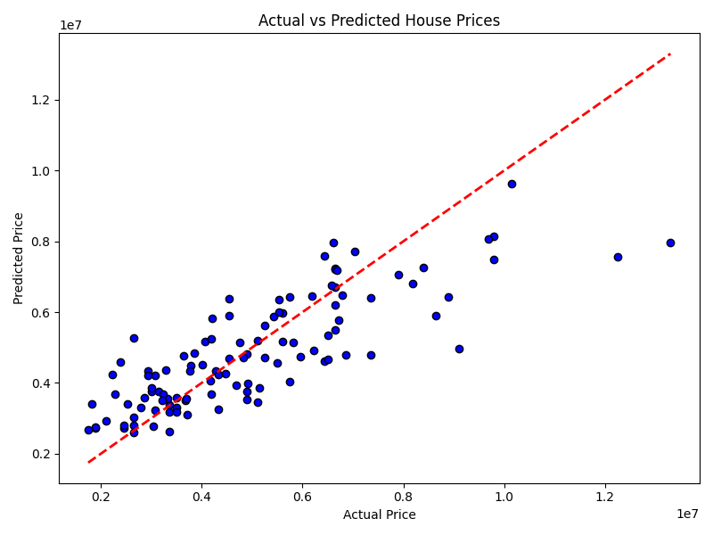

# House Price Prediction using Multiple Linear Regression

This project demonstrates a complete regression modeling pipeline to estimate house prices based on various numerical and categorical features in the housing dataset.

## 📁 Dataset
- **File Used:** `housing.csv`
- **Records:** 545 entries
- **Attributes:** 13 columns including price, area, bedrooms, bathrooms, and other house-related characteristics.

## 🛠️ Tools & Libraries
- Python 3.x
- pandas
- matplotlib
- seaborn
- scikit-learn

## 🎯 Project Goals
- Load and inspect the dataset
- Preprocess data (handle categorical variables using one-hot encoding)
- Train and test a **Multiple Linear Regression** model
- Evaluate the model using:
  - **Mean Absolute Error (MAE)**
  - **Mean Squared Error (MSE)**
  - **R² Score**
- Understand the influence of each feature on price
- Visualize model performance

## 📈 Model Results
- **MAE:** ≈ 970043  
- **MSE:** ≈ 1.75 × 10¹²  
- **R² Score:** ≈ 0.65

## 📸 Visual Outputs

### 🔹 Actual vs Predicted Price


### 🔹 Coefficient Influence
*Coefficients help interpret the impact of each input feature on the house price.*

---

## 💡 Interview Prep Questions
- What are the assumptions in linear regression?
- What is the significance of R² score?
- Difference between MAE and MSE?
- What happens if assumptions are violated?
- How to detect multicollinearity?

---

## 👩‍💻 Author

**Hema Sri**  
AIML Intern | Learner | Exploring data science and predictive modeling

---

## 🔗 Repository

[https://github.com/Hemasripatkuri4/HousePrice-Prediction-Regression-HemaSri/tree/main](https://github.com/Hemasripatkuri4/HousePrice-Prediction-Regression-HemaSri/tree/main)

---

```bash
Feel free to fork ⭐, commit 📥, and contribute 💡 to this project!
```


